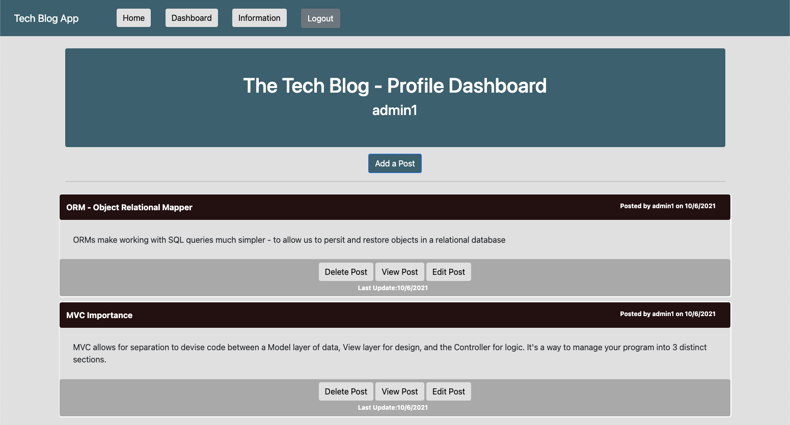

# The Tech Blog
CMS-style Tech blog where users create a username/password to publish tech blog posts and comment on other's posts as well. 

Follows MVC paradigm - powered by Express.js, Passport.js and MySQL/Sequelize

 
 
 
 
 
 
 
 

 

### [Deployed App (Heroku)](https://tech-blog-mvc-sh.herokuapp.com/)

### [Github Repo](https://github.com/ssharp0/tech-blog)

## Table of Contents

- [Description](#description)
- [User Story](#user-story)
- [Usage](#usage)
- [Installation](#installation)
- [Screenshots](#screenshots)

## Description

This is an application that allows a user to register to the site by creating a username and password (through passport.js authentication). The user can create, edit, and delete posts - as well as comment on posts from other users. Non registered users can view the home page with posts. 

Note, this app uses the dotenv package to use environment variables to store sensitive data (MySQL username and password)

## User Story

Allows users who write and are curious about tech to publish blog posts on thoughts and opinions.

## Usage

The main page will show all posts/comments to registered and non registered users.

The user will be prompted to log in to the site if the user clicks comment/dashboard/login. 

A use can register a username/password and log into the site. 

Once logged in, the user can view all posts from all users and make comments on the home page. The user can also navigate to their dashboard where they can view their posts, delete their posts, and/or edit their posts.

The user can logout of the application, and after a certain amount of time the user will be logged out of the site.

## Installation

Node.js & MySQL required

`npm init -y`

`npm i mysql2`

`npm i sequelize`

`npm i express`

`npm i dotenv`

`npm i passport`

`npm i passport-local-sequelize`

`npm i jsonwebtoken`

`npm i passport-jwt`

## Screenshots

Home Page (landing) with posts and comments

Login

Register

Dashboard Page

Create Post

View Post

Edit Post

